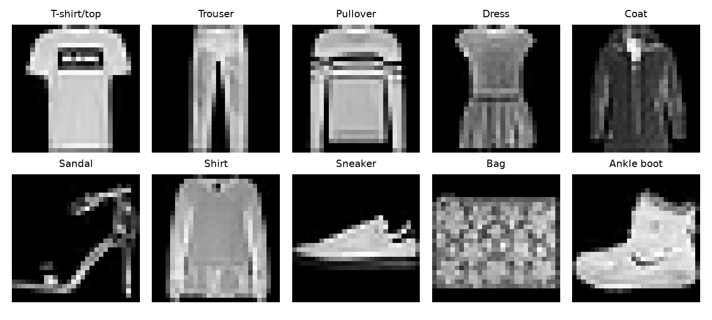
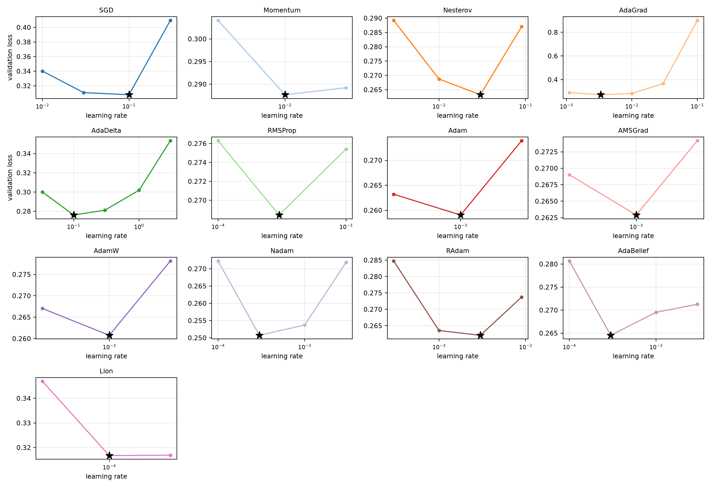
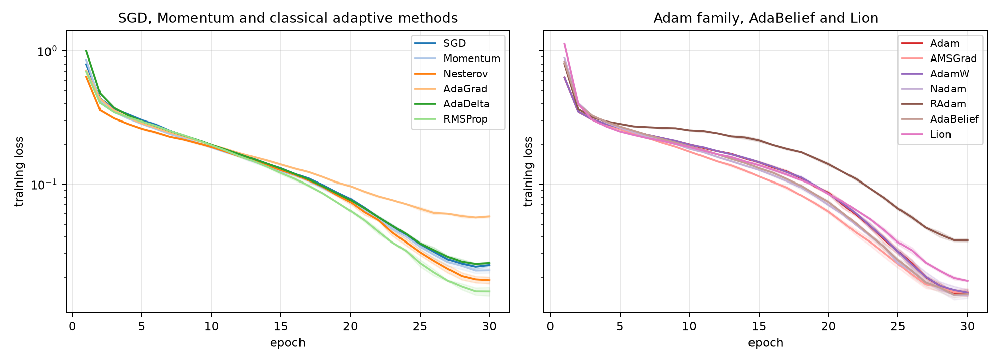
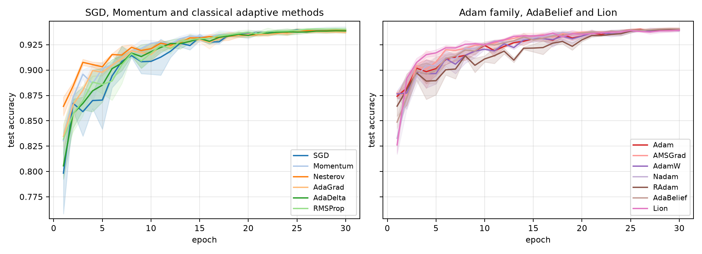
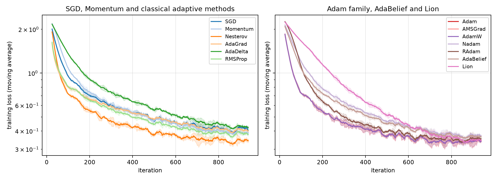
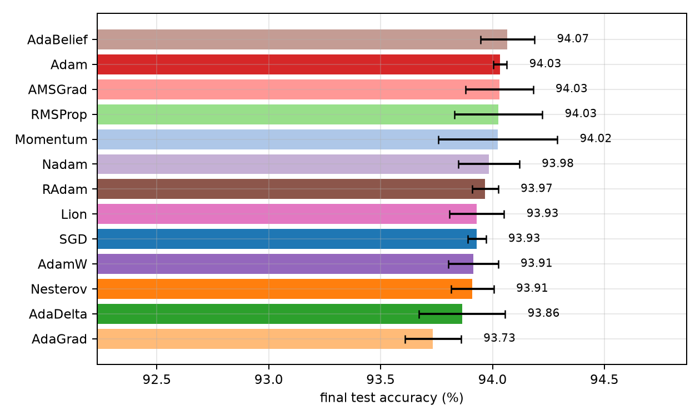
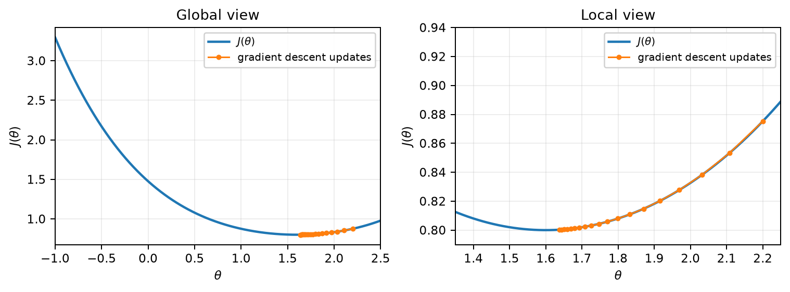
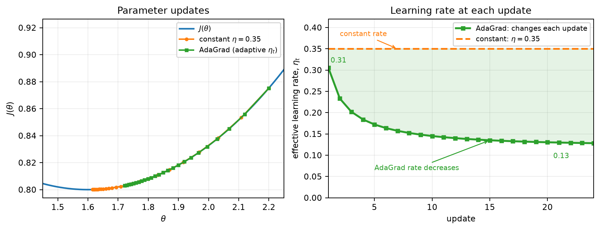

# Deep Learning: An Optimization Problem

### A Reproducible Benchmark for First-Order Optimizers on Fashion-MNIST

Compare optimizer behavior with a shared CNN, controlled learning-rate sweeps, and repeated runs.

This repository contains the code accompanying paper, [*Deep Learning: an Optimization Problem*](deep_learning_optimization_paper.pdf). The paper reviews first-order optimization methods and presents a CNN training result comparison using the FashionMNIST dataset; this codebase provides the model, optimizer implementations, and experiment workflow behind that study.

**Overview** · **[Get Started](#-get-started)** · **[Benchmark](#-benchmark)** · **[Results](#-results)** · **[Project Structure](#-project-structure)** · **[Citation](#-citation)**

## 📌 Overview

This project benchmarks 13 first-order optimization methods on Fashion-MNIST. Every method uses the same FashionCNN architecture and data pipeline, making it easier to compare convergence, stability, and final test performance under a consistent training protocol.

The experiment runner performs a learning-rate sweep, selects the best candidate, and repeats the full training run with fixed seeds. Eleven optimizers use native PyTorch implementations; AdaBelief and Lion use the project implementations.

### Highlights

- Learning-rate sweeps followed by repeated runs
- OneCycleLR scheduling for all optimizers
- Training, validation, and iteration-level metrics saved as JSON
- Plotting tools for loss curves, accuracy, and optimizer comparisons
- PyTorch Lightning training with `uv`-managed dependencies

## 🔬 Benchmark

### Optimizers considered

The study includes the following optimization algorithms:

- SGD
- Momentum
- Nesterov Momentum
- AdaGrad
- AdaDelta
- RMSProp
- Adam
- AMSGrad
- AdamW
- Nadam
- RAdam
- AdaBelief
- Lion

### Experimental setup

The model is FashionCNN, with 304,682 trainable parameters: three blocks with 32, 64 and 128 channels, each containing two bias-free 3x3 Conv-BatchNorm-ReLU layers, max pooling and Dropout2d(0.1). Global average pooling feeds a 128-to-128-to-10 classifier with ReLU and Dropout(0.4). The loss is cross entropy; input normalization remains mean 0.2860 and standard deviation 0.3530, without augmentation.

Each optimizer is evaluated under the same architecture and data pipeline. The same initialization and minibatch ordering are preserved for each seed. The default budget is 30 epochs, three seeds and batch size 128. A two-epoch sweep uses the first 20,000 training examples and validates on the last 10,000. Final runs train on all 60,000 training examples and evaluate on the official 10,000-image test set.

The runner uses OneCycleLR for every optimizer. Its peak learning rate is ten times the sweep-selected value, and the scheduler steps after every optimizer update. Momentum cycling is disabled. AdamW uses weight decay 1e-4. Instantiating `FashionCNN()` without an optimizer name uses native PyTorch AdamW. The model also provides test accuracy, a test confusion matrix, and probability predictions.

The experimental procedure is:

1. load and normalize the Fashion-MNIST dataset,
2. perform a learning-rate sweep for each optimizer,
3. select the best learning rate,
4. retrain for multiple seeds,
5. store training metrics and compare the final results.

## 🧩 Get Started

The project requires Python 3.11 or later and uses `uv` to manage dependencies and the virtual environment.

```bash
uv sync
```

## 🚀 Run the Experiment

Start the full benchmark with the default settings:

```bash
uv run python fashion_mnist_main.py --epochs 30 --seeds 3 --sweep-epochs 4 --sweep-size 20000
```

The run uses batch size 128, trains final models on all 60,000 training examples, and evaluates them on the official 10,000-image test set. Results are written to `results/results_fashioncnn_pytorch.json`. Resuming requires an identical configuration; use a different `--out` path when changing the training budget.

The complete benchmark can take several hours. (with a T4 GPU)

For a short smoke test:

```bash
uv run python fashion_mnist_main.py --only AdamW --epochs 1 --seeds 1 --sweep-epochs 1 --sweep-size 1000 --out results/smoke_fashioncnn.json
```

Available optimizer names for `--only` are `SGD`, `Momentum`, `Nesterov`, `AdaGrad`, `AdaDelta`, `RMSProp`, `Adam`, `AMSGrad`, `AdamW`, `Nadam`, `RAdam`, `AdaBelief`, and `Lion`.

### Generate Plots

```bash
uv run python plot_results.py --results results/results_fashioncnn_pytorch.json
```

Use `--results results/smoke_fashioncnn.json` to plot a short trial. Figures are written to `images/` and the table to `results/table.tex`; use `--images` and `--table` to override these paths.

### Train on Colab

[](https://colab.research.google.com/github/brunoneri/deeplearning_optimization/blob/main/fashion_mnist_pytorch_optimizers.ipynb) select a GPU runtime, and execute the cells in order. No repository files are needed for training. Enable `USE_DRIVE` to persist data across Colab sessions. Only completed trials and runs are resumable, not interrupted epochs.

## 🗂 Project Structure

- `dataloader/fashion_mnist_data.py` — Fashion-MNIST loading, normalization, and `LightningDataModule`
- `model/fashion_mnist_model.py` — `FashionCNN`, OneCycleLR, and the optimizer registry (`CNN` remains an alias)
- `fashion_mnist_main.py` — learning-rate sweep, repeated runs, and result persistence
- `optimizers/custom.py` — AdaBelief and Lion implementations
- `plot_results.py` — plotting and result visualization
- `fashion_mnist_pytorch_optimizers.ipynb` — standalone experiment with the same model and plots
- `deep_learning_optimization_paper.pdf` — PDF paper

## 📊 Results

The repository includes figures for the dataset, learning-rate sweep, training dynamics, and final comparison. Regenerate plots from a results file with `plot_results.py` to visualize a new run.

### Dataset samples



### Learning-rate sweep



### Training loss



### Test accuracy



### Iteration-level training dynamics



### Final comparison summary



### Additional figures






## 🔁 Reproducibility and Extensions

Runs use fixed seeds and save their learning-rate sweeps and metrics in JSON. The modular model and data pipeline can be extended to compare additional optimizers, batch sizes, or datasets.


 
## License

This project is intended for educational and research use.
